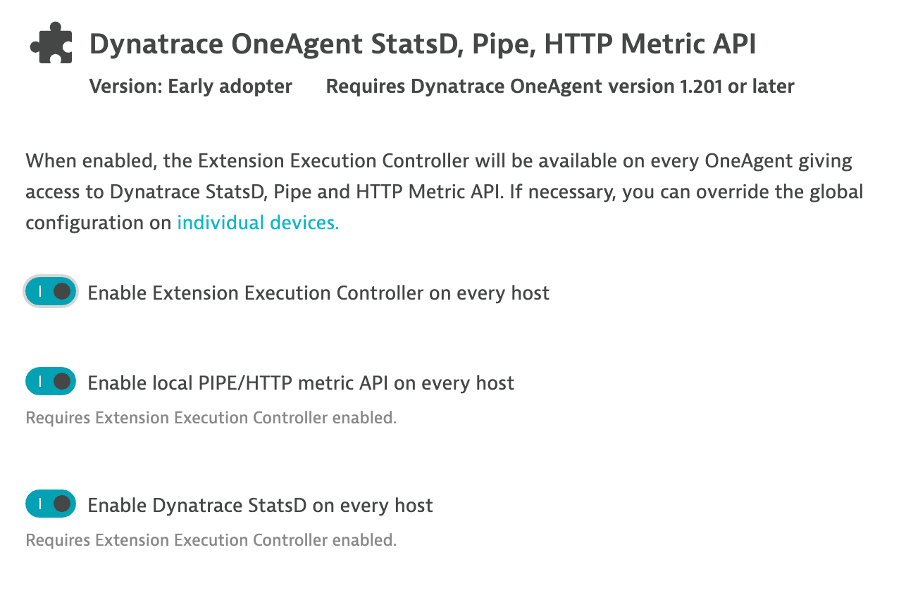

## Turn on Metric Ingest

### Step 1: Turn on Metric Ingest in the Dynatrace UI
1. Navigate to Manage > Settings > Monitoring > Monitored Technologies and scroll down to the bottom of the list
2. Click on Dynatrace OneAgent StatsD, Pipe, HTTP Metric API
3. Turn on enable Extension Execution Controller on every host and enable local PIPE/HTTP metric API on every host

