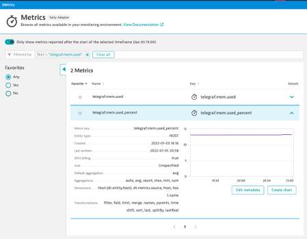
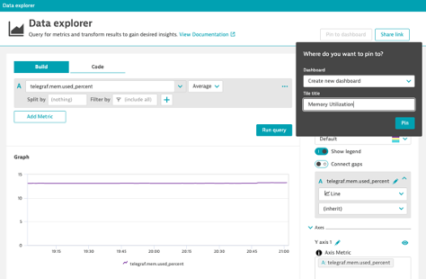

## Metrics Browser

### Step 1: Search for a metric by name
1. Navigate to Observe and Explore > Metrics
2. Search for metric by name
`telegraf.mem.used_percent`
3. Favorite the metric
4. Which dimensions are available?

### Step 2: Add the memory metric to a dashboard
1. Create Chart > Pin to Dashboard
2. Tile Name: Memory Utilization

### Step 3: Name the Dashboard
1. Rename the dashboard "Infrastructure Overview"
