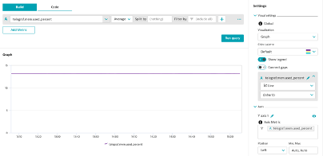
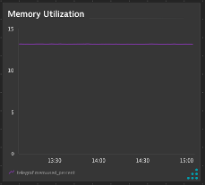

## Data Explorer

### Step 1: Find the Memory Metric in the Data Explorer
1. Navigate to Observe and Explore > Explore Data
2. Search for the Telegraf Mem metric
3. Pin the Memory Used Percent metric to the dashboard
4. Tile Title: Memory Utilization
5. Aggregation: Average
6. Visualization: Column Graph

### Step 2: Which way was easier, browser or explorer?
1. Why would you use one over the other?

