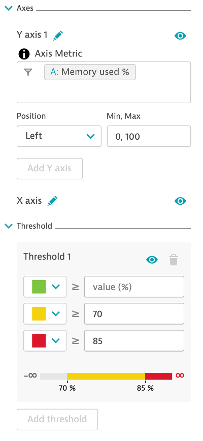
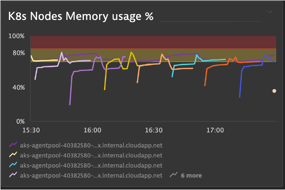

## Thresholds

### K8s Memory Threshold
1. Chart the memory used % metric in the Explorer
2. Split by: Host
3. Filter by: Host: Software technologies: Kubernetes
4. Aggregation: Average
5. Left Axis: Min 0, Max 100
6. Threshold: Green: Blank, Yellow: 70, Red: 85
7. Visualization: Line Graph

### Pin to dashboard
1. Tile Title: K8s Nodes Memory Used %

