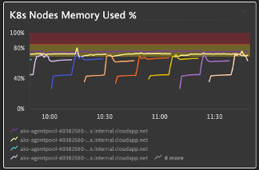

## Thresholds

### Scenario
- You have different Kubernetes Nodes and want to verify their memory consumption
- You want to identify easily which ones are trespassing the warning and severe thresholds

### Visualize thresholds on charts
1. Chart the "Memory used %" metric in the Explorer
2. Split by: Host
3. Filter by: Host: Software technologies: Kubernetes
4. Aggregation: Average
5. Left Axis: Min 0, Max 100
6. Threshold: Green: Blank, Yellow: 70, Red: 85
7. Visualization: Line Graph

### Pin to dashboard
1. Tile Title: K8s Nodes Memory Used %

