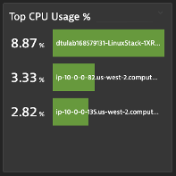

## Top List with Thresholds

### Scenario
- You have multiple hosts monitored and would like to have a list of those with high CPU usage
- You want to identify easily which ones are trespassing the warning and severe thresholds

### CPU Usage %
1. Create a top list with CPU Usage %
2. Aggregation: Average
3. Split by: host
4. Fold Transformation: Last value
5. Threshold: Green: 0, Yellow: 70. Red: 85

### Pin to dashboard
1. Tile Title: Top CPU Usage %

