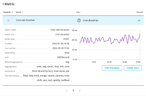
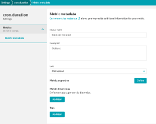

## Metric Metadata

### Scenario
- The custom metrics from the cron job are being imported but the units are missing
- You want to update the metric to use MilliSeconds as unit

### Add metric metadata for the cron job duration metric
1. In the Metrics Browser, search for cron.duration
2. Click edit metadata button
3. Display name: Cron Job Duration
4. Unit: Millisecond
5. Save and return to Metrics Browser to see your changes!

