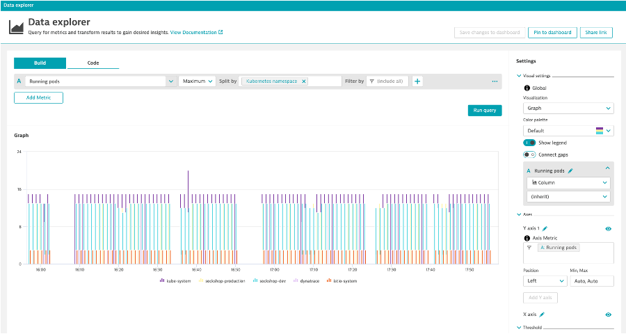
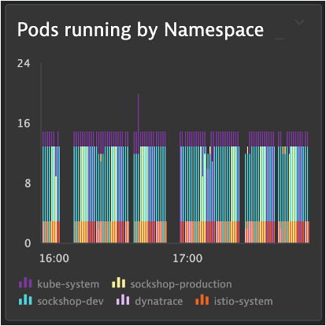

## Splitting

### K8s Network Process Load
1. Metric: builtin:cloud.kubernetes.namespace.runningPods
2. Aggregation: Max
3. Split by: Kubernetes Namespace
4. Visualization: Column Graph

### Pin to dashboard
1. Tile Name: Pods running by Namespace

