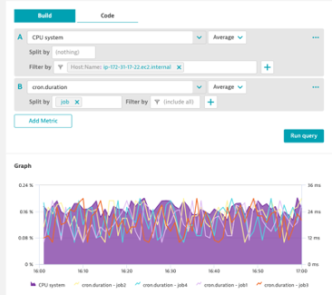

## Cron Job vs CPU

### Scenario
- Some of our cron jobs are taking longer than normal and we want to see if it’s CPU related

### Create an area chart for CPU system Usage
1. Metric: builtin:host.cpu.system
2. Aggregation: Average
3. Filter: Host: Name: Your EC2 EasyTravel instance

### Create a line chart with Cron Job Duration
1. Metric: cron.duration
2. Aggregation: Average
3. Split by: Job

### Pin to dashboard
1. Tile Name: Cron Job Duration vs CPU

