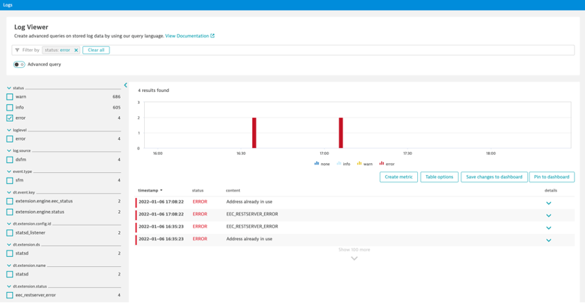
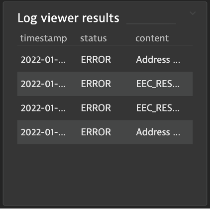

## K8s Logs and Events

### Scenario 
- You would like to chart some Kubernetes cluster event or log patterns (like evicted events)

### Pin table from log viewer
1. Create a query for status=“INFO”
2. Pin our table to Infrastructure Overview dashboard

