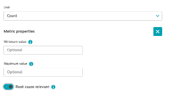
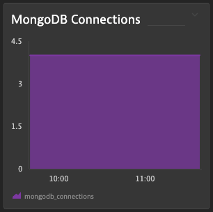

## Prometheus Mongo DB Metric

### Metric Metadata
1. Navigate to Observe and Explore - Metrics
2. Search for mongodb_connections
3. Edit metric metadata
4. Unit: Count
5. Metric Properties: Toggle on Root Case Relevant

### Metrics Explorer
1. Search for mongodb_connections
2. Tile Title: MongoDB Connections
3. Aggregation: Count
4. Pin to dashboard

