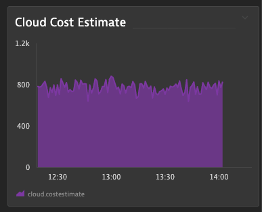
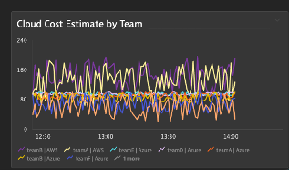

## Cloud Cost Overview

### Scenario
- You are pulling external metrics from your cloud providers with billing information
- You want to review the total billing and each teams consumption

### Create an area overview cloud cost chart
1. Metric: cloud.costestimate
2. Aggregation: SUM
3. Tile Title: Cloud Cost Estimate
4. Pin to the Infrastructure Overview dashboard

### Create a line chart, breaking down the response time by provider and team
1. Metric: cloud.costestimate
2. Split by: provider and team
3. Aggregation: SUM
4. Tile Title: Cloud Cost Estimate by Team
5. Pin to the Infrastructure Overview dashboard

