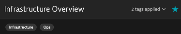
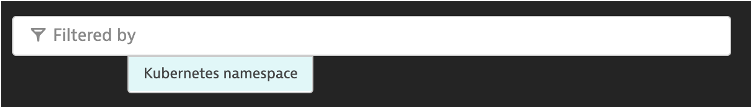

## Dashboarding

### Scenario
- You want to have this dashboard available for everybody
- Also easily make it easy to filter and find it

### Let's clean up the dashboard
1. Add tags: Infrastructure, Ops
2. Favorite the dashboard
3. Add a Dynamic Filter for Kubernetes Namespace
4. Add host health tile, problems tile, and headers
5. Share the dashboard as preset

