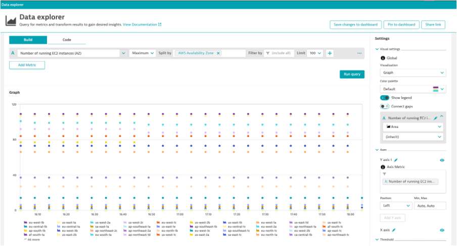
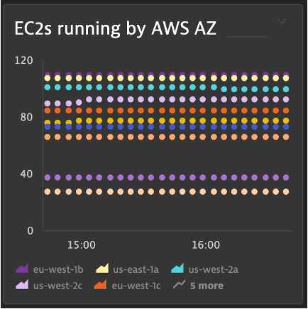

## Optional: Instance by Availablity Zone

### Scenario
- You want to identify those AWS Availability Zones that are more busy and identify any spike or drop

### Chart out EC2s by AWS AZ
1. Metric: builtin:cloud.aws.az.running
2. Aggregation: Max
3. Split by: AWS Availablity Zone

### Pin to dashboard
1. Tile Name: EC2s running by AWS AZ

