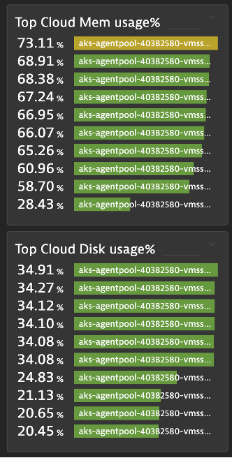

## Optional: Top List with Threshold

### Create two separated Top List tiles for Memory and Disk 
1. Aggregation: Average
2. Split by: Host
3. Metrics: builtin:host.mem.usage,builtin:host.disk.usedPct
4. Fold Transformation: Last
5. Threshold: Green: 0, Yellow: 70, Red: 85
6. Pin to dashboard

