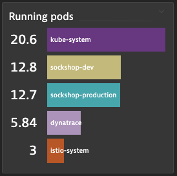
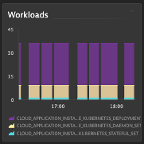

## Optional: Running Pods and Workloads

### Create a Top list chart
1. Metric: builtin:cloud.kubernetes.namespace.runningPods
2. Split By: namespace
3. Aggregation : Sum
4. Transformation: Last value 
5. Pin to dashboard

### Create Graph Area chart
1. Metric: builtin:cloud.kubernetes.namespace.workloads
2. Split By: Deployment type
3. Aggregation: Average
5. Pin to dashboard

