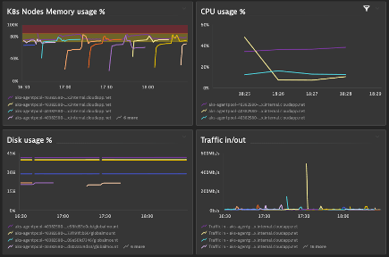

## Optional: Kubernetes nodes infra metrics

### Complete the dashboard with the Kubernetes nodes Memory, Traffic and Disk usage %
1. Try to use the Clone and Code options
2. Metrics: builtin:host.cpu.usage, builtin:host.disk.usedPct, builtin:host.net.nic.trafficIn, builtin:host.net.nic.trafficOut

