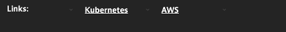

## Optional: Markdown links

### Create a link section, at the bottom, with markdowns from the infrastructure dashboard
1. Create a mark down link to Kubernetes overview page
2. Mark down example: `##[Kubernetes](/ui/kubernetes)`
3. Create a markdown link to AWS overview page
4. Mark down example: `##[AWS](#awses)`
5. What differs when the URLs used on the markdowns are full URLs?
6. Example: `##[AWS](https://{tenant_URL}/#awses)`

