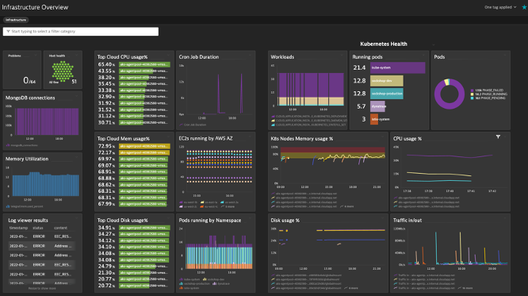

## Metric Browser and Data Explorer

In this section, you will learn to leverage the Metric Browser and Data Explorer to visualize metrics and create powerful dashboards.



### Exercise Prep
1. Navigate to the Dynatrace University Terminal and ensure you're connected to the Easytravel Server

2. Clone the GitHub repo to the Easytravel Server

```bash
git clone https://github.com/JasonOstroski/Perform-Hot-22-Cloud-Infra.git
```

3. Navigate to the Perform-Host-22-Cloud-Infra directory

```bash
cd Perform-Hot-22-Cloud-Infra
```

4. Start the Cron Job Monitoring script

```bash
python3 cronjobduration.py
```

5. This will start a script that reports the duration of Cron job executions to the OneAgent. We need this data during this exercise.
