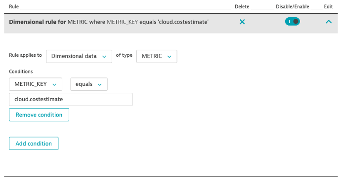
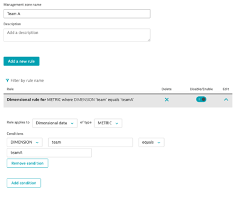

## Management Zones

### Look at the cloud.costestimate metric in the metric browser and gain insights on available data dimensions

###Scenario
- You have different App teams that spin up resources in AWS and Azure
- You have a finance team that should see all cost estimates, but only cost data, no observability data
- Team A and Team B have their own budget and only want to see their own cloud costs
- Create management zones to cover all 3 scenarios
- What happens to the cloud cost tiles in the infrastructure overview dashboard when you select the different management zones?
- Explore this in the Metric Explorer too!

###Navigate to the Management Zones Settings
1. Navigate to Manage > Settings > Preferences > Management Zones

