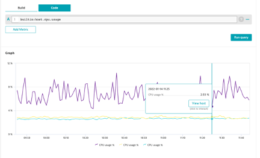

## Code Tab

### Go to Data Explorer and select the "Code" tab
1. Start typing builtin
2. The command helper will pop-up
3. Use the metric `builtin:host.cpu.usage`
4. Run query

### What is the output?
