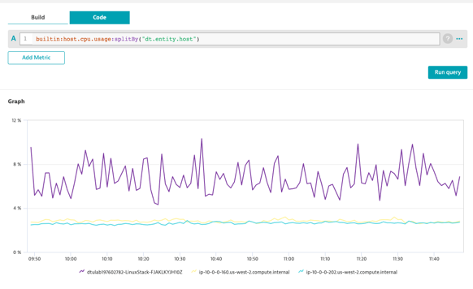

## Advanced Expressions Split

### Split it by host
1. Use the transformation :splitBy()
2. Use the dimension dt.entity.host

```bash
builtin:host.cpu.usage:splitBy("dt.entity.host")
```

3. Click on Run Query



### What is the output?
