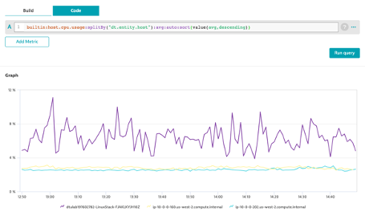

## Advanced Expressions Sort

### Descending Sort

1. Aggregation
2. Use the aggregation :avg()
3. Click on Run Query
4. Sort it descending
5. Use the transformation :sort()
6. With value(avg ,descending)

```bash
builtin:host.cpu.usage:splitBy("dt.entity.host"):avg:auto:sort(value(avg,descending))
```



