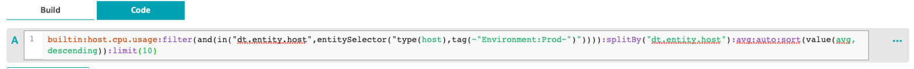
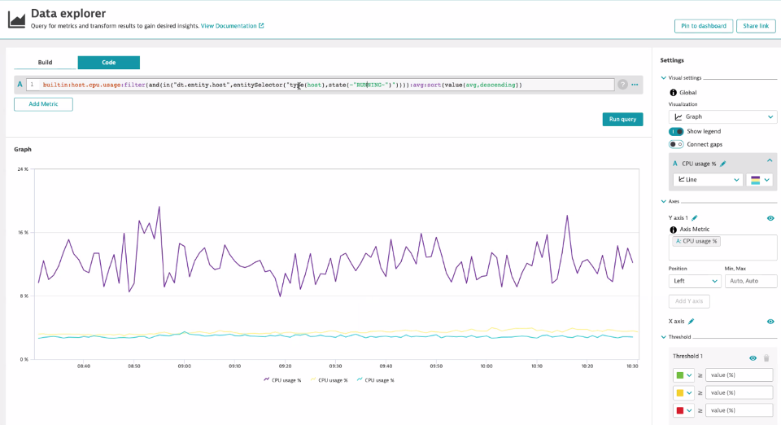

## Advanced Expressions Entity Selector

### Filter by Host State=Running
1. Use the transformation :filter()
2. Use the operator and() inside the filter() transformation
3. Use the operator in() inside the and() operator
4. Inside the in() operator, compare the dimension "dt.entity.host" with an entitySelector
5. Use the transformation entitySelector("type(host),state(~"RUNNING~")")

```bash
builtin:host.cpu.usage:filter(and(in("dt.entity.host",entitySelector("type(host),state(~"RUNNING~")")))):splitBy("dt.entity.host"):avg:sort(value(avg,descending)):limit(10)
```



### What is the output?


