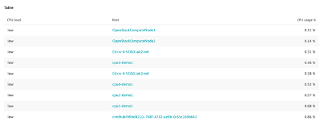

## Advanced Expressions Group Table

### Host grouped by CPU load
1. Metric: builtin:host.cpu.usage
2. Aggregation: avg
3. Group hosts by their CPU load with the transformation partition
4. :partition(CPU Load,value("busy", range(80,100)),value("medium", range(30,80)),value("low", range(0,30)))
5. Filter by CPU Load = "low"
6. Sort by avg and ascending
7. Chart type: table
```bash
 builtin:host.cpu.usage:avg:partition(CPU Load,value("busy",range(80,100)),value("medium",range(30,80)),value("low",range(0,30))):splitBy("CPU Load","dt.entity.host"):filter(eq("CPU Load","low")):sort(value(avg,ascending))
 ```


### What is the output?
