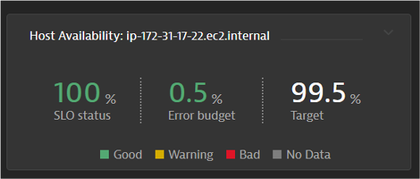

## Host Availablity SLO

### SLO Name: Host Availablity: HOST-ID
1. Metric

```bash
builtin:host.availability:filter(and(in("dt.entity.host",entitySelector("type(host),entityId("HOST-ID")")))):splitBy("dt.entity.host")
```

2. How do we find the HOST-ID? Use your EC2 Instance
3. SLO Filter:

```bash
entityId("HOST-ID")
```
4. Target Percentage: 99.5%
5. Warning Percent: 99.75%
6. Timeframe: -1d


