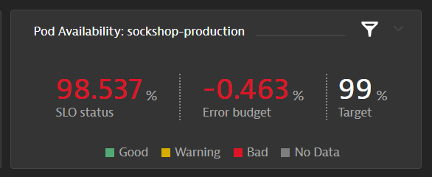

## Pod Availablity SLO

### SLO Name: Pod Availability: sockshop-production 
1. Metric

```bash
(builtin:cloud.kubernetes.namespace.runningPods:filter(and(in("dt.entity.cloud_application_namespace",entitySelector("type(cloud_application_namespace),entityName(~"sockshop-production~")")))):splitBy("dt.entity.cloud_application_namespace"))/(builtin:cloud.kubernetes.namespace.desiredPods:filter(and(in("dt.entity.cloud_application_namespace",entitySelector("type(cloud_application_namespace),entityName(~"sockshop-production~")")))):splitBy("dt.entity.cloud_application_namespace"))*(100)
```

2. Evaluation Type: Aggregate
3. SLO Filter:
```bash
type(cloud_application_namespace),entityName("sockshop-production")
```
4. Target Percentage: 99%
5. Warning Percent: 99.5%
6. Timeframe: -1d


