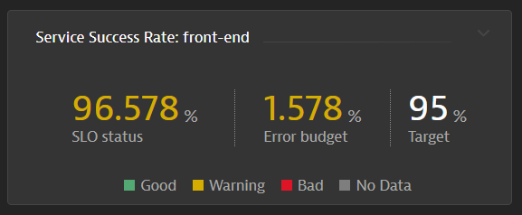

## Optional - Service Success Rate SLO

### Name: Service Success Rate: front-end
1. Metric

```bash
builtin:service.successes.server.rate:filter(and(in("dt.entity.service",entitySelector("type(service),entityName(~"front-end~")")))):splitBy("dt.entity.service")
```

2. Evaluation Type: Aggregate
3. SLO Filter:
```bash
type(service),entityName("front-end")
```
4. Target Percentage: 99%
5. Warning Percent: 97%
6. Timeframe: -1d


