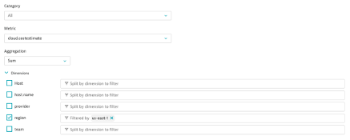
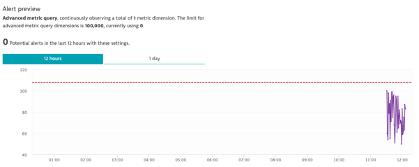

## Auto-Adaptive Baseline

### Navigate to Settings > Anomaly Detection > Custom Events for Alerting and create an auto-adaptive baseline alert
1. Metric: cloud.costestimate
2. Aggregation: SUM
3. Region: us-east-1
4. Alert of anomalies of 1 time the normal signal fluctuation.
5. Metric is above baseline for 1 minute during any 5 minute period.
6. Name: Increased Cloud Cost
7. Severity: Custom Alert

