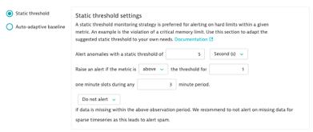
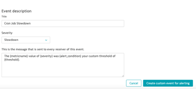
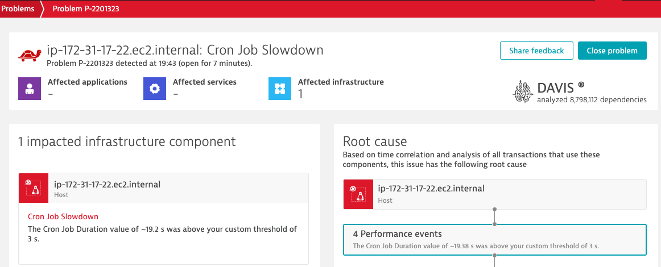

## Static Threshold

### Create a static threshold on Cron Job Duration
1. Metric: cron.duration
2. Aggregation: Average
3. Entity: Host
4. Static Threshold: 5 Seconds
5. What’s the recommended threshold?
6. Raise if above threshold for 1 minute during 3 minute period
7. Review the Alert Preview



8. Title: Cron Job Slowdown
9. Severity: Slow down



### Let's slow it down!
1. Navigate back to the DTU Terminal for the EasyTravel server
2. Stop the cloudcosts.py script if it’s still running (Ctrl + C)
3. Run timedatectl to check the current time
4. Ex: 1828 is 1:28 PM EST or 18:28 UTC
5. Start the retail script:

```bash
python3 cronjobduration.py HHMM 10
```

6. HHMM is the time you’d like the problem scenario to start
7. Start it a few minutes after the current time
8. 10 is the number of minutes you’d like the scenario to run for
9. Wait a few minutes and let’s see the problem!

### Review the problem ticket


