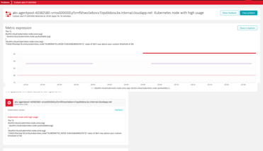

## Metric Expression Alert

### Name: Service Success Rate: front-end
1. K8s & Metric Expressions – Node High Usage
2. Create a new Custom event for alerting
3. Select the Code option

```bash
(((builtin:cloud.kubernetes.node.cores:avg)-(builtin:cloud.kubernetes.node.cpuAvailable:avg))/(builtin:cloud.kubernetes.node.cores:avg)*(100))
```

4. In the "Advanced entity settings" Select "Kubernetes Node" as primary entity
5. Set static threshold to 80
6. Above threshold for 3 slots during 5 period
7. Event Severity: Resource


