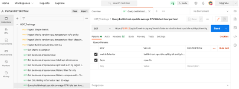

## Postman

### Postman Prep
1. Create a workspace: PerformHOT2022
2. Import from RAW Text
3. Open a new browser tab: https://github.com/JasonOstroski/Perform-Hot-22-Cloud-Infra 
4. View Raw of metricsapipostmancollection.json
5. Copy the entire text and paste into Postman - Import

### Let's get data from the Metric API!
1. For the CPU and Disk GET requests: Replace {{tenant}} in GET with your Dynatrace Environment
2. Be mindful that it’s easy to copy and paste https:// and it’s already in the GET request
3. Replace {{API_TOKEN}} in the header with your API Token
4. You can also do the replacements via Postman environments
