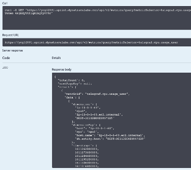

## Metric API

### Before we can use the Metric API, we need to get a token

1. Settings>Integration>Dynatrace API

2. Generate Token, name it, and turn on:
3. API v2 - Read Metrics, Write Metrics, Ingest metrics, Read Entities
4. API v1 – Access problems and event feed, metrics, and topology, read configuration, write configuration, and user sessions
5. Copy the token and store in a safe place!

### Navigate to the API explorer
1. Environment API v2
2. Authorize and paste in API Token
3. GET /metrics/query 
4. Metric Selector: telegraf.cpu.usage_user
5. View available options and output

