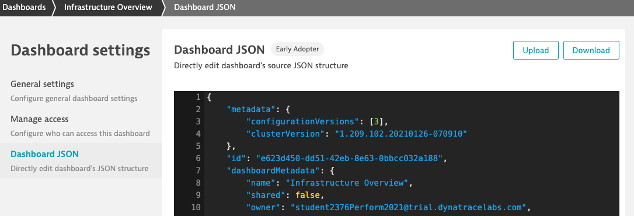

## Dashboard Export

### How can I bring my dashboard home with me?
1. Go to your Infrastructure Overview dashboard
2. Click ... Button in upper right corner > Share > Advanced Settings
3. Click dashboard JSON > Download
4. This is also available in the Configuration API for managing dashboards at scale

