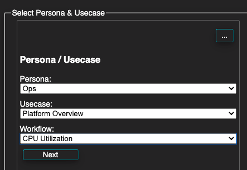

## Configurator

### We spent a lot of time today building dashboards, wouldn't it be cool to automated some of this?

1. https://dynatrace.github.io/BizOpsConfigurator
2. Enter your tenant URL and API Token
3. Deploy Ops, Platform Overview, CPU Utilization (no diamond)
4. Deploy Ops, Platform Overview, Disk Utilization (no diamond)
5. Deploy Ops, Platform Overview, Memory Utilization (no diamond)
6. Deploy Ops, Platform Overview, Network Observability (no diamond)
7. Navigate back to the Dynatrace UI and see the new dashboards!

