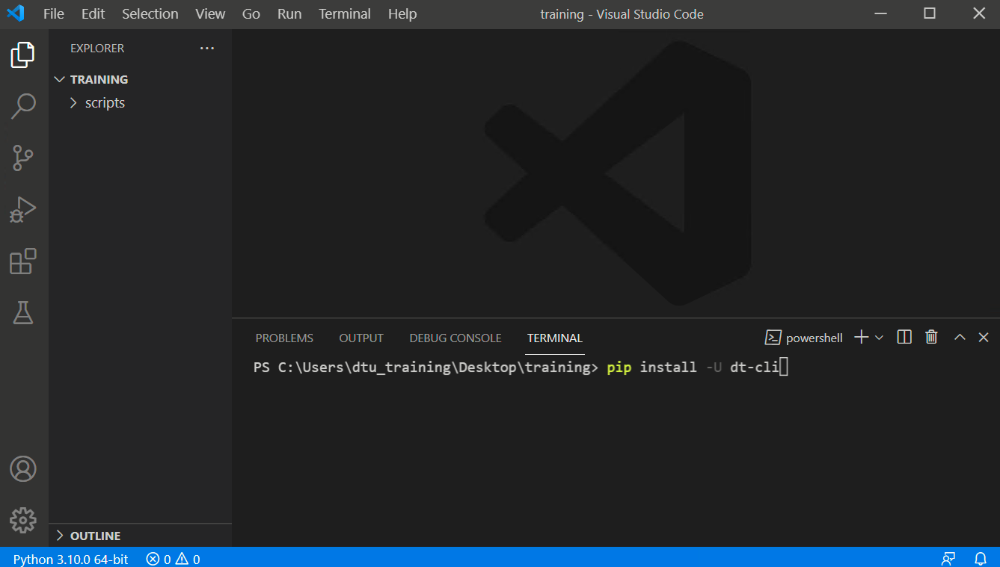
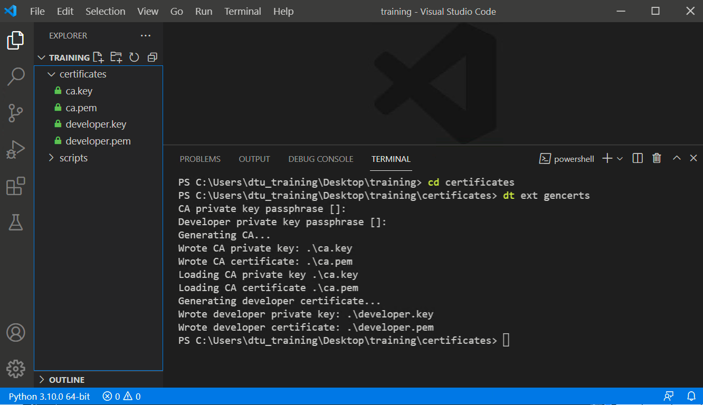
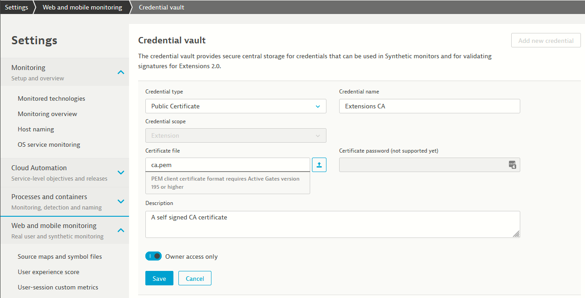
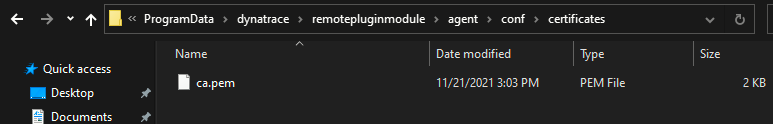
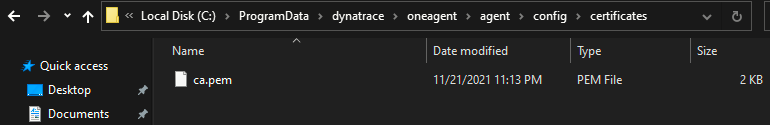

# Certificates

Extensions 2.0 need to be signed with a `developer certificate`.  
Dynatrace will only accept extensions that were signed with a `trusted certificate.`  
  
This is a security measure, as these extensions are `automatically deployed to OneAgent and Activegates`, and these servers must trust the issuing certificate, otherwise the extensions are blocked. 

## Create and distribute the certificates

### Install dt-cli

We will install the [dt-cli](https://github.com/dynatrace-oss/dt-cli) utility to manage our certificates and build our extensions. 

Open VSCode from the Desktop or the Start Menu

1. Click `File` > `Open Folder`, and open the `training` folder on your desktop
2. Open the terminal with ``ctrl + ` ``  or click `View` > `Terminal`
3. Run the command `pip install -U dt-cli`
    * This will install or update the [dt-cli](https://github.com/dynatrace-oss/dt-cli) python library
    * We will use this library to generate certificates and build our extensions

### Generate certificates

 
1. Create a folder called `certificates` 
    * You can click `New Folder`, which is the second icon next to  `TRAINING` in the left menu in vscode
    * Or run the command `mkdir certificates` in the terminal
2. Run `cd certificates` in the terminal
3. Run the command `dt ext gencerts`
    * You can press enter when it asks for the passphrases for now
    * This command will generate four files in the current directory
    * `ca.key` - The private key for the CA (Certificate Authority) certificate
    * `ca.pem` - The CA certificate, this will be used to generate the developer certificate
    * `developer.key` - The private key for the developer certificate
    * `developer.pem` - The developer certificate, generated with the CA certificate
    * Both `key` files are yours, and should never be distributed, they give ownership to the `.pem` files
    * In a real world scenarion, the `CA` would be a `trusted CA` by your company, and not a self generated `CA` like here, read [more details here](https://www.dynatrace.com/support/help/shortlink/sign-extension). 

### Upload the CA certificate to Dynatrace

Next, we will let the Dynatrace cluster know that this `CA` can be trusted, in your browser:

1. From the navigation menu, select `Settings > Web and mobile monitoring > Credential vault`
2. `Select Add new credential`
3. For Credential type, select `Public Certificate`.
4. Add a meaningful `Credential name`, like `Extensions CA`
5. Upload the `ca.pem` file, that should be under `Desktop > training > certificates > ca.pem`
6. Select `Save`.

### Place the CA certificate into the OneAgent and Activegate

We also need to let the OneAgents and Activegates machines know that they can trust this `CA`. This needs to be done only once per `CA`.
  

**Copy** the `ca.pem` file to the Activegate certificates folder:

* `C:\ProgramData\dynatrace\remotepluginmodule\agent\conf\certificates`

**Copy** the `ca.pem` file to the OneAgent certificates folder:

**NOTE - create the certificates folder if it doesn't exist already**

* `C:\ProgramData\dynatrace\oneagent\agent\config\certificates`

