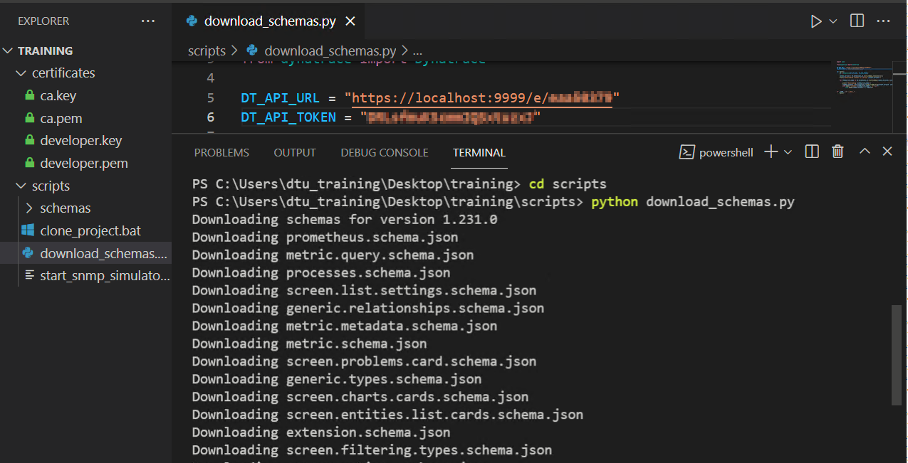
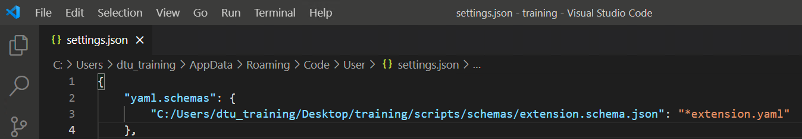

## Extension Schemas

There is a script called `download_schemas.py` in the `Desktop\training\scripts` folder.

This script can be used to automatically download the latest version of the `extensions schema` from the Dynatrace API.

The schema has definitions for every element that we can use within our `extension.yaml` files.

`Visual Studio Code` (and other IDEs like `PyCharm`) can make use of this information, to catch mistakes, auto-complete, suggest code as we are creating the extensions.

Here is the content of the script:

```python
import json

from dynatrace import Dynatrace

DT_API_URL = "https://localhost:9999/e/TENANT"
DT_API_TOKEN = "TOKEN"

def main():
    dt = Dynatrace(DT_API_URL, DT_API_TOKEN)

    latest_version = dt.extensions_v2.list_schemas_versions()[-1]
    print(f"Downloading schemas for version {latest_version}")

    for schema_file_name in dt.extensions_v2.list_schemas(latest_version).files:

        print(f"Downloading {schema_file_name}")
        schema_contents = dt.extensions_v2.get_schema_file(latest_version, schema_file_name)
        with open(f"schemas/{schema_file_name}", "w") as f:
            json.dump(schema_contents, f, indent=2)


if __name__ == "__main__":
    main()

```

Update the `DT_API_URL` and `DT_API_TOKEN` variables, replacing `TENANT` with your tenant ID, and `TOKEN` with the API token, then:

1. `cd scripts`
2. `python download_schemas.py`



This will create a folder called `schemas`, with all of the schema `.json` files inside.  

VSCode is already configured to parse schemas from these files, you can check the configuration by pressing `F1` and clicking `Preferences: Open Settings (JSON)`. This setting only works because the [YAML](https://marketplace.visualstudio.com/items?itemName=redhat.vscode-yaml) vscode extension has been installed as well.


