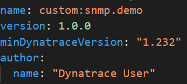

# Exploring the SNMP extension

The yaml file for this extension already exists, let's grab it:

1. Double click the `clone_project.bat` file, under `Desktop/training/scripts`
    * Alternetivaly, you can also run `git clone --depth=1 https://github.com/Dynatrace/perform-2022-hotday.git C:\Users\dtu_training\Desktop\training\perform-2022-hotday`

This will create a folder called `perform-2022-hotday` in the `Desktop/training` folder, our extension is in `extensions-as-code/snmp-demo-extension`

## Structure

The `extension.yaml` file for this extension has five sessions

### Mandatory fields

The first lines are the mandatadory fields for any extension, they have metadata that includes:

* `name`: must start with `custom:` for custom extensions
* `version`: Follows [simver](https://simver.org/) format
* `minDynatraceVersion`: This is an important fields, it determines both:
    * The schema version that we are targeting
    * The minimum Activegate (or OneAgent) version that is able to run this extension
* `author`

### SNMP

The SNMP session is comprised of `groups` and `subgroups`.  
Inside them, we define what are the metrics and the dimensions we want to capture, and how often we want to capture them.

The first group is capturing a system level metric every five minutes.  

The ID of the metric is `custom.snmp.sys.uptime`, the value is whatever the OID (Object IDentifier) `1.3.6.1.2.1.1.8.0` returns.

We also add one dimension to this metric, called `sys.name`. The value of this dimension is also coming from an OID, `1.3.6.1.2.1.1.5.0`

  

Note that for both of these, we can also use the corresponding MIB values: `oid:SNMPv2-MIB::sysORLastChange.0` and `oid:SNMPv2-MIB::sysName.0`.  

There is a list of MIB files that come bundled with the Activegate, under `C:\Program Files\dynatrace\remotepluginmodule\agent\datasources\snmp\mib-files`