# Exploring the SNMP extension

The yaml file for this extension already exists, let's grab it:

1. Double click the `clone_project.bat` file, under `Desktop/training/scripts`
    * Alternetivaly, you can also run `git clone --depth=1 https://github.com/Dynatrace/perform-2022-hotday.git C:\Users\dtu_training\Desktop\training\perform-2022-hotday`


This will create a folder called `perform-2022-hotday` in the `Desktop/training` folder, our extension is in `extensions-as-code/snmp-demo-extension`

## Structure

The `extension.yaml` file for this extension has five sessions, which we will explore now.

* Mandatory properties
* snmp
* metrics (Optional)
* topology (Optional)
* screens (Optional)

### Mandatory properties

The first lines are the mandatadory properties for any extension, they have metadata that includes:

* `name`: must start with `custom:` for custom extensions
* `version`: Follows [simver](https://simver.org/) format
* `minDynatraceVersion`: This is an important fields, it determines both:
    * The schema version that we are targeting
    * The minimum Activegate (or OneAgent) version that is able to run this extension
* `author`

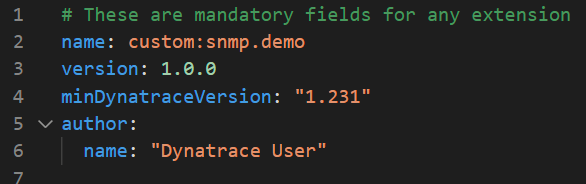

Since we have vscode validating our schema, you can delete one of these fields and immediately get an error, stating that you are missing a mandatory property.

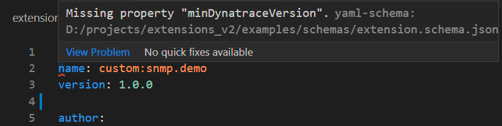

### SNMP

The `snmp` session is comprised of `groups` and `subgroups`.  
Inside them, we define what are the metrics and the dimensions we want to capture, and how often we want to capture them.

The first group is capturing a system level metric every five minutes.  

The ID of the metric is `custom.snmp.sys.uptime`, the value is whatever the OID (Object IDentifier) `oid:SNMPv2-MIB::sysORLastChange.0` returns.

We also add one dimension to this metric, called `sys.name`. The value of this dimension is also coming from an OID, `oid:SNMPv2-MIB::sysName.0`
  
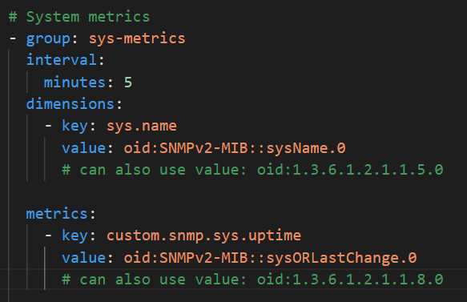

We can test that these values return what we expect, by perfoming an `snmpget` command. The Windows VM has the `net-snmp` package installed, so you can run:

```bash
snmpget -v 2c -c network/firewall/paloalto-pa-5000 localhost:1024 SNMPv2-MIB::sysName.0 SNMPv2-MIB::sysORLastChange.0
```

And you should receive the output:

```
SNMPv2-MIB::sysName.0 = STRING: Palo Alto PA-5000 - Dev Environment
SNMPv2-MIB::sysORLastChange.0 = Timeticks: (15329345) 1 day, 18:34:53.5
``` 

#### MIBs

Note that for both of these we can also use the corresponding raw OID values: `oid:1.3.6.1.2.1.1.8.0` and `oid:1.3.6.1.2.1.1.5.0`, these can be used when you don't have access to the MIB (Management Information Base) files to translate the OIDs.

There is a list of MIB files that come bundled with the Activegate, under `C:\Program Files\dynatrace\remotepluginmodule\agent\datasources\snmp\mib-files`.  
We can also bundle new MIB files in our extension, under a `snmp` folder, these will be parsed as well.


#### Tables

Sometimes we don't want to get a specific value for a single OID, but we want to iterate over a list of OIDs. A basic example is when we want to monitor the Network Interfaces of our devices.  

Writing `oid:IF-MIB::ifDesc:1, oid:IF-MIB::ifDesc:2, oid:IF-MIB::ifDesc:3, etc` is not practical, so Dynatrace provides a way for us to get all `oid:IF-MIB::ifDesc` at once, this is called an `SNMP table`.  

Our extension makes use of this technique, by setting `table: true` in the subgroup configuration


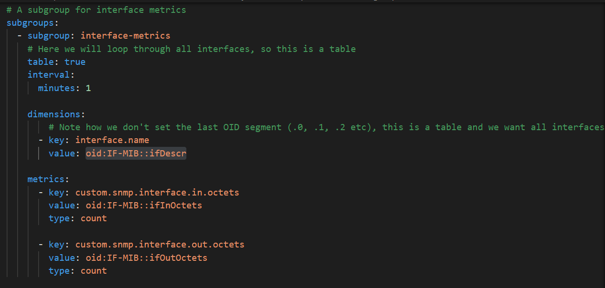


## Metrics

The `metrics` session is optional but it is always a nice addition to any extension, it provides metric metadata like `displayName` and `unit`. These will make your extension easier to use, understand and chart.

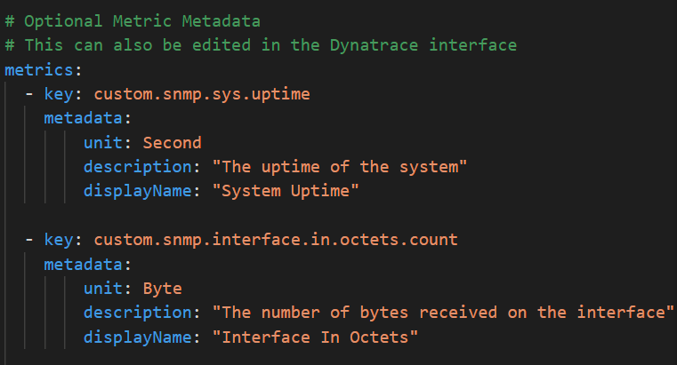

In our example, an user would be able to search for the metric `Interface In Octets`, which is much better than `custom.snmp.interface.in.octets.count`.

We have also declared that the unit for this metric is `Byte`, so Dynatrace will display it correctly in charts, and even convert to `MegaByte`, `GigaByte`, etc when appropriate, so that humans can easily consume the data.  

The metadata can also be accessed (and edited) directly in Dynatrace, under `Metrics` in the left menu.

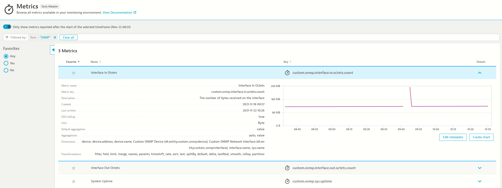


Take a note of the dimensions in the screenshot above. We only declared a single dimension, called `interface.name` in the `extension.yaml`, but we have several more showing, most are automatically added to all SNMP extensions, like `device`,  `device.address` and `device.name`.

There are also two special dimensions called `dt.entity.custom_snmp:device` and `dt.entity.custom_snmp:interface` which will be discussed later.  


Another important thing to note about metric metadata, you can declare it for **any** *MINT* metric present in Dynatrace, you are not limited to metrics captured in the same extension.yaml file. So if you are ingesting metrics from some other source, like [telegraf](https://www.dynatrace.com/support/help/shortlink/telegraf) for instance, you can have an `extension.yaml` that only declares metadata about those metrics

## Topology

Like metrics, `topology` is an optional session but a powerful one. Here we can declare entities and relationships between them. These will be new entities created in Dynatrace, and they open up several interesting capabilities.  

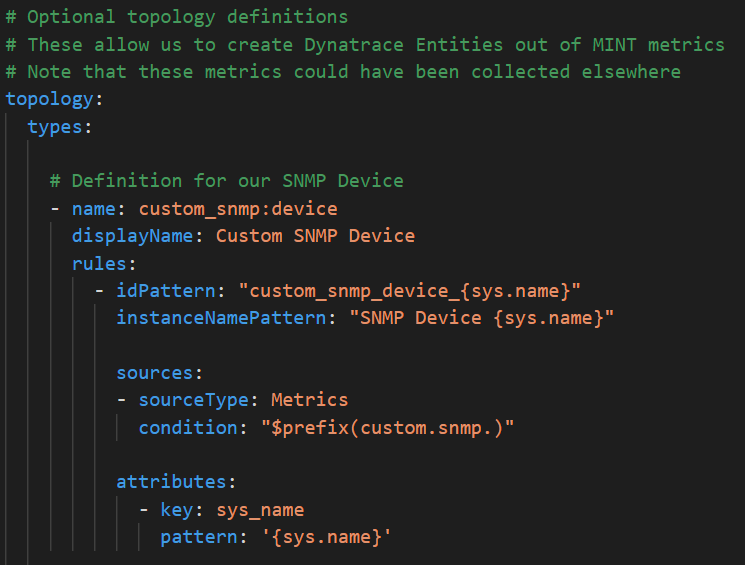

A reminder, the Dynatrace architecture is comprised of entities, every metric will be attached to some Dynatrace entity even when none is declared (the `ENVIRONMENT` entity in that case)

You can use our API to get the list of all types, example python code:

```python
for entity_type in dt.entities.list_types():
    print(entity_type)
```

You will see types like HOST, CLOUD_APPLICATION, CUSTOM_DEVICE, AZURE_VM, etc. An average tenant will have over 300 types!

The topology session allow us to define new types, in our case we are creating two types:

* `custom_snmp:device`
    * This type will be created when we find a metric with the `sys.name` dimension
    * We are only looking for metrics where the ID starts with `custom.snmp.`
    * You can see that every metric we collect here will fit that condition
    * We are adding a single attribute to our new entity, called `sys_name`
* `custom_snmp:interface`
    * This type will be created when we find a metric with the `interface.name` dimension
    * This time we only look for metrics starting with `custom.snmp.interface.`

After we deploy this extension, we can query the Dynatrace API for our newly created types! Example: `/api/v2/entityTypes/custom_snmp:interface` 

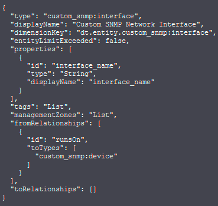


As you can see in the screenshot there is also a session about `fromRelationships`, this was also declared in the `topology` session of our extension. We declared that an interface `RUNS_ON` a device.


These entities are now correlated to one another. This is also where the two special dimensions we saw earlier `Custom SNMP Network Interface` and `Custom SNMP Device` come from, they are `entities` dimensions, and there are nice features about them like being able to click their names in a dashboard to drill down to that entity, and also defining custom entity screens. Not to mention everything else that comes with any entity.  

Note that like metrics, these types and relationships can also be created directly in the Dynatrace interface, under `Settings > Topology Model`.

 
## Screens

Once you have `entities`, you can also have `screens`. This is a powerful new feature in Dynatrace that allows you to customize what the user sees when they navigate to an entity page (or to the list of entities).  

We have declared a screen for the `custom_snmp:device` entity, we start by declaring what details we want to see and setting a screen layout. The layout will have two sessions, a list of network interfaces and a chart.


The layout is pointing to two elements, with IDs `network-interfaces` and `sys-charts`, they are declared right after:

We have a chart for our only metric:

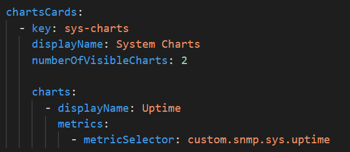

And we have our network interface list:

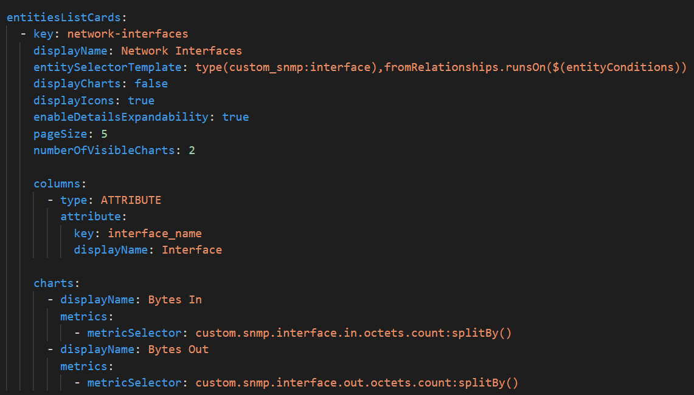

When we navigate to one of our network devices, we will see these elements:

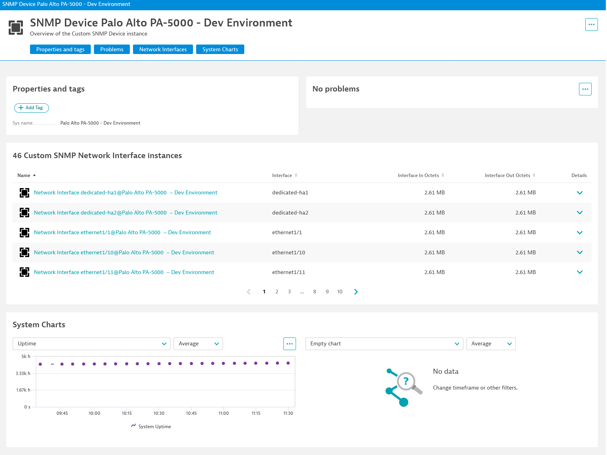

You can find links to all our network devices from `https://<tenant _url>/ui/entity/list/custom_snmp:device`

As of `Dynatrace 1.232` screens cannot be created via the UI, only via the `extension.yaml` file.

