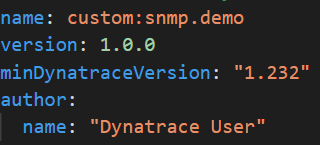
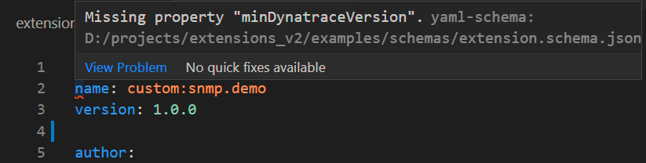

## Mandatory properties

The first lines are the mandatadory properties for any extension, they have metadata that includes:

* `name`: must start with `custom:` for custom extensions
* `version`: Follows [simver](https://simver.org/) format
* `minDynatraceVersion`: This is an important fields, it determines both:
    * The schema version that we are targeting
    * The minimum Activegate (or OneAgent) version that is able to run this extension
* `author`

Since we have vscode validating our schema, you can delete one of these fields and immediately get an error, stating that you are missing a mandatory property.

