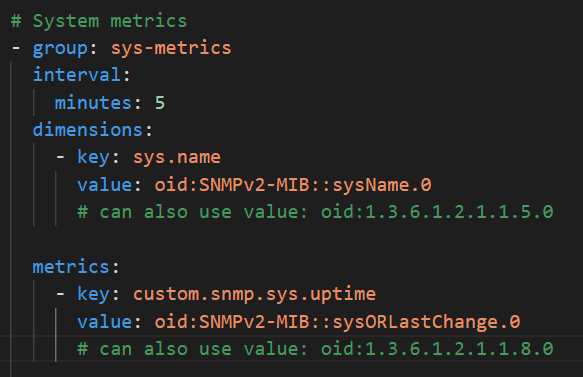
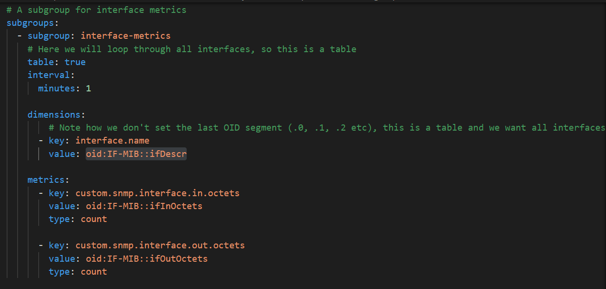

## SNMP

The `snmp` session is comprised of `groups` and `subgroups`.  
Inside them, we define what are the metrics and the dimensions we want to capture, and how often we want to capture them.

The first group is capturing a system level metric every five minutes.  

The ID of the metric is `custom.snmp.sys.uptime`, the value is whatever the OID (Object IDentifier) `oid:SNMPv2-MIB::sysORLastChange.0` returns.

We also add one dimension to this metric, called `sys.name`. The value of this dimension is also coming from an OID, `oid:SNMPv2-MIB::sysName.0`
  


We can test that these values return what we expect, by perfoming an `snmpget` command. The Windows VM has the `net-snmp` package installed, so you can run:

```bash
snmpget -v 2c -c network/firewall/paloalto-pa-5000 localhost:1024 SNMPv2-MIB::sysName.0 SNMPv2-MIB::sysORLastChange.0
```

And you should receive the output:

```
SNMPv2-MIB::sysName.0 = STRING: Palo Alto PA-5000 - Dev Environment
SNMPv2-MIB::sysORLastChange.0 = Timeticks: (15329345) 1 day, 18:34:53.5
``` 

### MIBs

Note that for both of these we can also use the corresponding raw OID values: `oid:1.3.6.1.2.1.1.8.0` and `oid:1.3.6.1.2.1.1.5.0`, these can be used when you don't have access to the MIB (Management Information Base) files to translate the OIDs.

There is a list of MIB files that come bundled with the Activegate, under `C:\Program Files\dynatrace\remotepluginmodule\agent\datasources\snmp\mib-files`.  
We can also bundle new MIB files in our extension, under a `snmp` folder, these will be parsed as well.


### Tables

Sometimes we don't want to get a specific value for a single OID, but we want to iterate over a list of OIDs. A basic example is when we want to monitor the Network Interfaces of our devices.  

Writing `oid:IF-MIB::ifDesc:1, oid:IF-MIB::ifDesc:2, oid:IF-MIB::ifDesc:3, etc` is not practical, so Dynatrace provides a way for us to get all `oid:IF-MIB::ifDesc` at once, this is called an `SNMP table`.  

Our extension makes use of this technique, by setting `table: true` in the subgroup configuration



