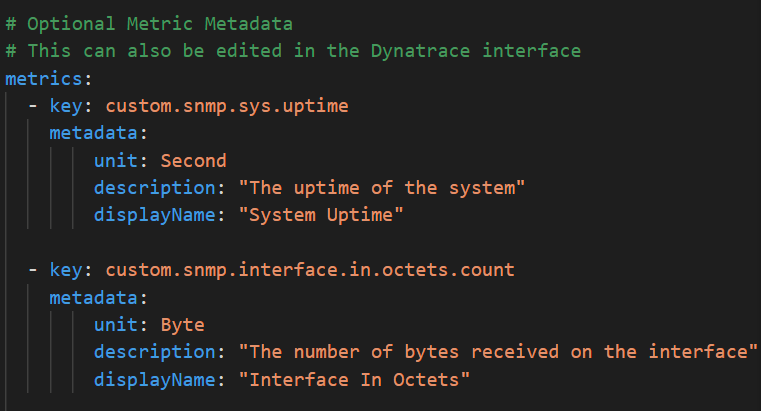
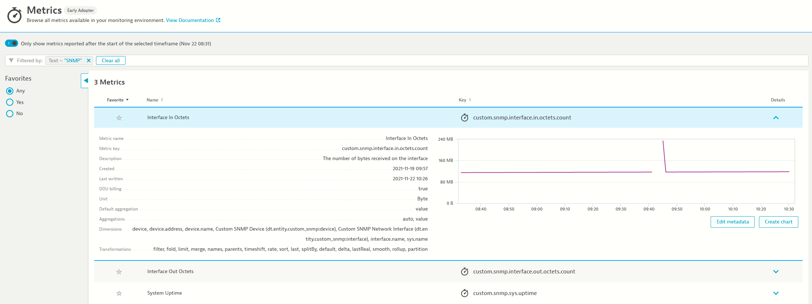

## Metrics

The `metrics` session is optional but it is always a nice addition to any extension, it provides metric metadata like `displayName` and `unit`. These will make your extension easier to use, understand and chart.

In our example, an user would be able to search for the metric `Interface In Octets`, which is much better than `custom.snmp.interface.in.octets.count`.

We have also declared that the unit for this metric is `Byte`, so Dynatrace will display it correctly in charts, and even convert to `MegaByte`, `GigaByte`, etc when appropriate, so that humans can easily consume the data.  

The metadata can also be accessed (and edited) directly in Dynatrace, under `Metrics` in the left menu.

Take a note of the dimensions in the screenshot above. We only declared a single dimension, called `interface.name` in the `extension.yaml`, but we have several more showing, most are automatically added to all SNMP extensions, like `device`,  `device.address` and `device.name`.

There are also two special dimensions called `dt.entity.custom_snmp:device` and `dt.entity.custom_snmp:interface` which will be discussed later.  

Another important thing to note about metric metadata, you can declare it for **any** *MINT* metric present in Dynatrace, you are not limited to metrics captured in the same extension.yaml file. So if you are ingesting metrics from some other source, like [telegraf](https://www.dynatrace.com/support/help/shortlink/telegraf) for instance, you can have an `extension.yaml` that only declares metadata about those metrics

