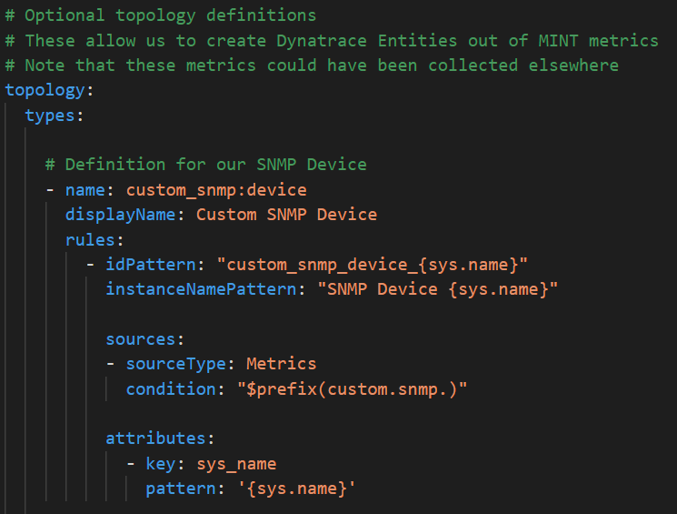
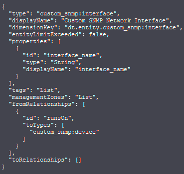
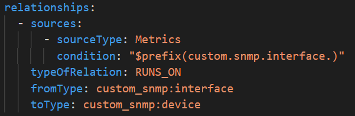

## Topology

Like metrics, `topology` is an optional session but a powerful one. Here we can declare entities and relationships between them. These will be new entities created in Dynatrace, and they open up several interesting capabilities.  



A reminder, the Dynatrace architecture is comprised of entities, every metric will be attached to some Dynatrace entity even when none is declared (the `ENVIRONMENT` entity in that case)

You can use our API to get the list of all types, example python code:

```python
for entity_type in dt.entities.list_types():
    print(entity_type)
```

You will see types like HOST, CLOUD_APPLICATION, CUSTOM_DEVICE, AZURE_VM, etc. An average tenant will have over 300 types!

The topology session allow us to define new types, in our case we are creating two types:

* `custom_snmp:device`
    * This type will be created when we find a metric with the `sys.name` dimension
    * We are only looking for metrics where the ID starts with `custom.snmp.`
    * You can see that every metric we collect here will fit that condition
    * We are adding a single attribute to our new entity, called `sys_name`
* `custom_snmp:interface`
    * This type will be created when we find a metric with the `interface.name` dimension
    * This time we only look for metrics starting with `custom.snmp.interface.`

After we deploy this extension, we can query the Dynatrace API for our newly created types! Example: `/api/v2/entityTypes/custom_snmp:interface` 




As you can see in the screenshot there is also a session about `fromRelationships`, this was also declared in the `topology` session of our extension. We declared that an interface `RUNS_ON` a device.



These entities are now correlated to one another. This is also where the two special dimensions we saw earlier `Custom SNMP Network Interface` and `Custom SNMP Device` come from, they are `entities` dimensions, and there are nice features about them like being able to click their names in a dashboard to drill down to that entity, and also defining custom entity screens. Not to mention everything else that comes with any entity.  

Note that like metrics, these types and relationships can also be created directly in the Dynatrace interface, under `Settings > Topology Model`.

