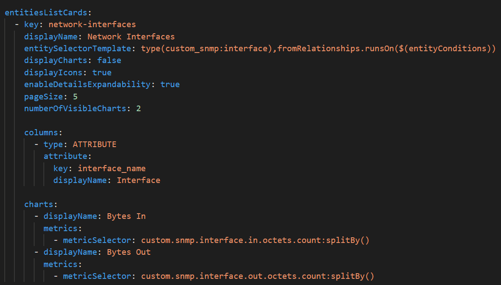
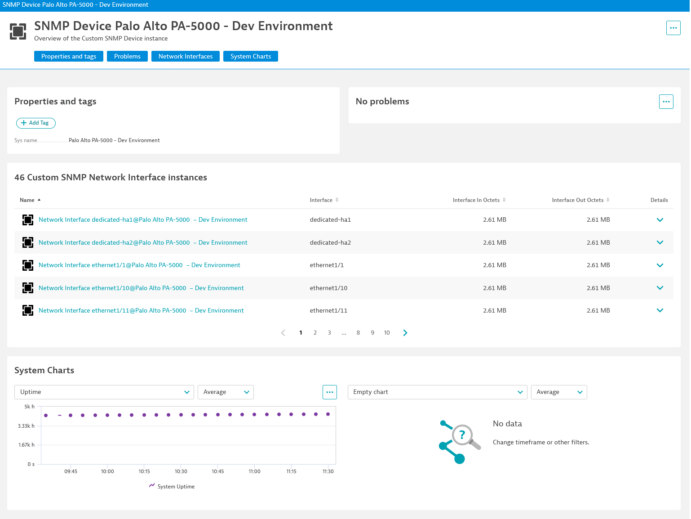

## Screens

Once you have `entities`, you can also have `screens`. This is a powerful new feature in Dynatrace that allows you to customize what the user sees when they navigate to an entity page (or to the list of entities).  

We have declared a screen for the `custom_snmp:device` entity, we start by declaring what details we want to see and setting a screen layout. The layout will have two sessions, a list of network interfaces and a chart.

The layout is pointing to two elements, with IDs `network-interfaces` and `sys-charts`, they are declared right after:

We have a chart for our only metric:

And we have our network interface list:

When we navigate to one of our network devices, we will see these elements:

You can find links to all our network devices from `https://<tenant _url>/ui/entity/list/custom_snmp:device`

As of `Dynatrace 1.232` screens cannot be created via the UI, only via the `extension.yaml` file.

