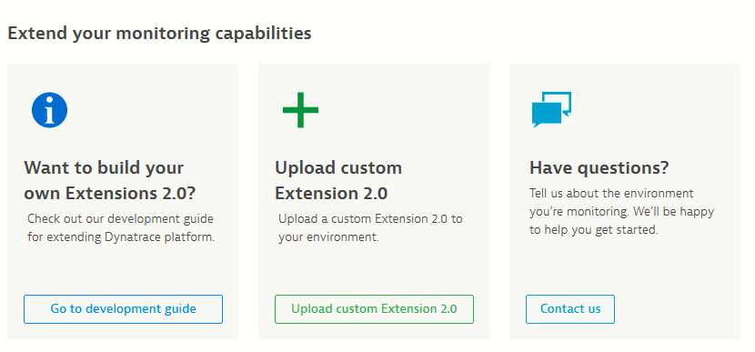
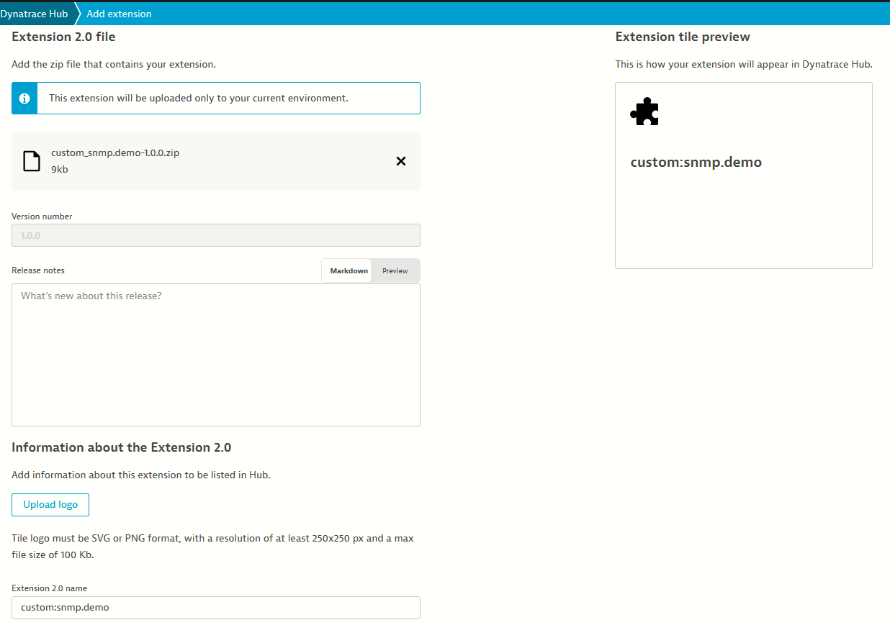
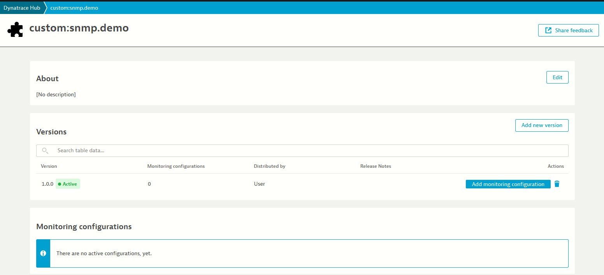

## Uploading the extension

Now that we have our extension zip file, we need to upload it to Dynatrace.  

There are two ways to do it, using the UI or the API.  

### UI

On the left menu, navigate to `Infrastructure > Extensions`, then:

* Click `Extensions 2.0 in your environments`
* Scroll down and click `Upload custom Extension 2.0`
* Click select a file, and upload the `custom_snmp.demo-1.0.0.zip` file to Dynatrace



Here you can also edit metadata about the extension, like giving it a nicer name, a logo and release notes



When you are done, click `Upload extension` at the bottom of the screen. You will be greeted with the extension page:





### API / Command Line

Another way to upload the extension is by using the Dynatrace API.  
The `dt-cli` tool comes with an `upload` command, so you can use:

```
dt ext upload --tenant-url TENANT_URL --api-token TOKEN custom_snmp.demo-1.0.0.zip
```

This will have the same effect of uploading the extension.
