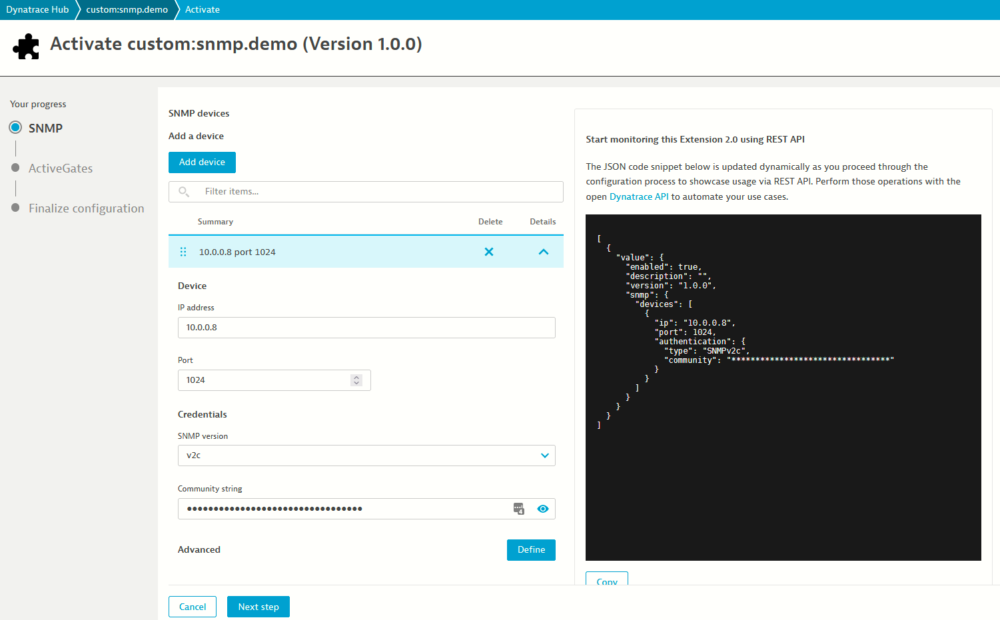
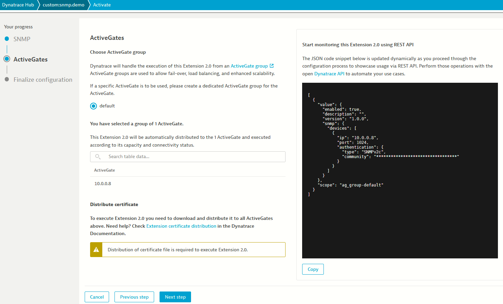
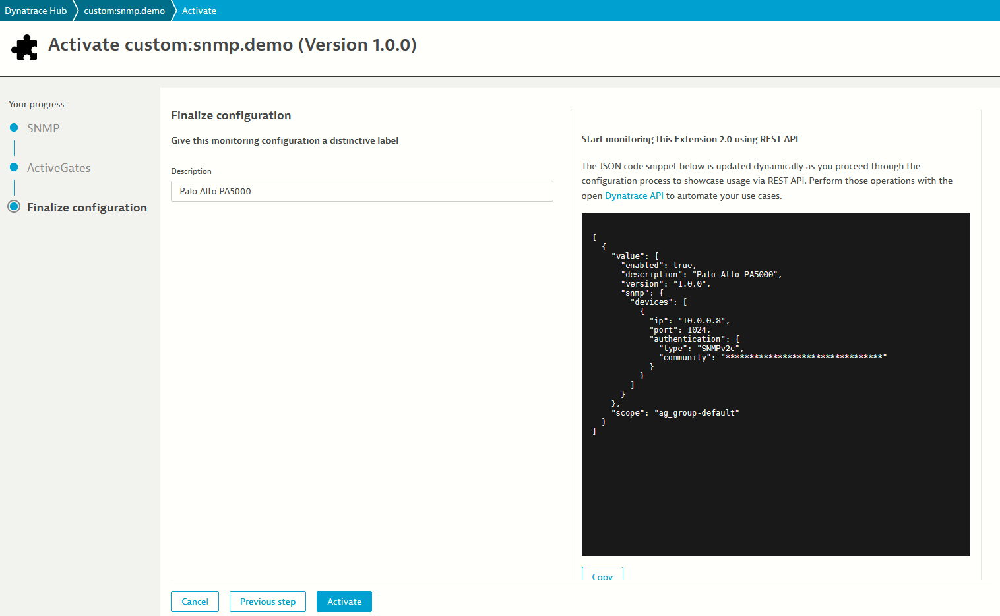
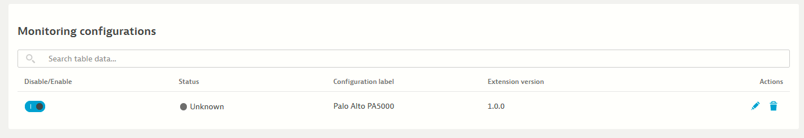
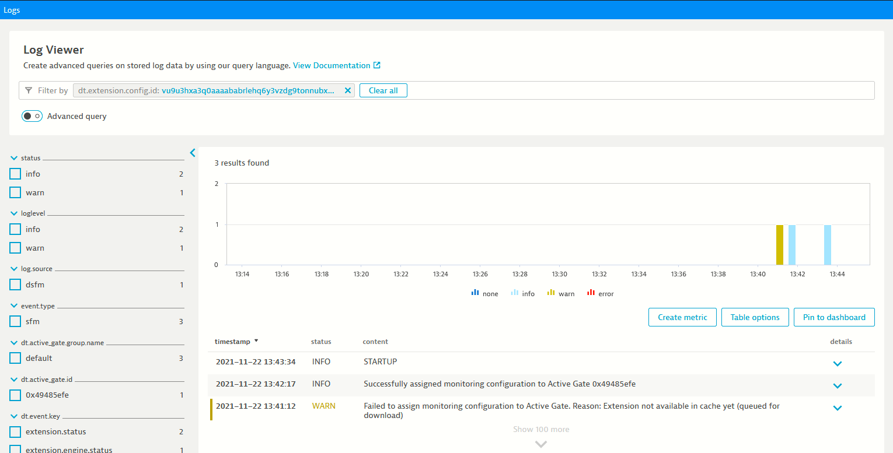

## Configuring the extension

The next step is for us to add some monitoring configurations to our extension, meaning we must let Dynatrace know which SNMP devices we want to monitor.  

This is done via `Monitoring Configurations`, and once again we can use the UI or the API to configure our extensions.

### UI

Using the UI, click `Add monitoring configuration` in the extension page.

You will be greeted with a Wizard, hit `Add device`

The settings are:

* IP address: `10.0.0.8`
* Port: `1024`
* SNMP version: `v2c`
* Community string: `network/firewall/paloalto-pa-5000`



Hit `Next step`

We only have a single Activegate group, called `default`.  
In this screen you get to select which Activegates will attempt to run your extension. Note that if you have more than one AG in a group you essentially have `High Availability`. Dynatrace will attempt to find an AG that is able to run the extension for you.



Hit `Next step`

Give the configuration a name, and hit `Activate` 




You can have up to 100 SNMP Devices in a single monitoring configurations, and many monitoring configurations.



Clicking the circle next to the monitoring configuration status will bring you to the logs about this configuration. Note that your tenant must have `Log Monitoring V2` enabled to access this feature.




### API

Monitoring configurations can also be set using the API.

Here is an example using our [python api client](https://github.com/dynatrace-oss/api-client-python):

```python
from dynatrace import Dynatrace
from dynatrace.environment_v2.extensions import MonitoringConfigurationDto


dt = Dynatrace("TENANT_URL", "API_TOKEN")

config = MonitoringConfigurationDto(
    scope="ag_group-default",
    configuration={
        "enabled": True,
        "description": "Palo Alto PA5000",
        "version": "1.0.0",
        "snmp": {"devices": [{"ip": "10.0.0.8", "port": 1024, "authentication": {"type": "SNMPv2c", "community": "*********"}}]},
    },
)
dt.extensions_v2.post_monitoring_configurations("custom:snmp.demo", [config])
```
