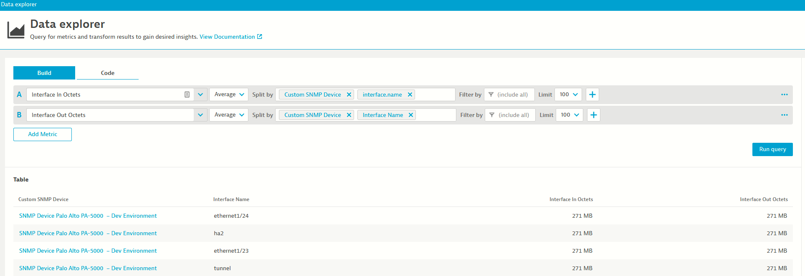
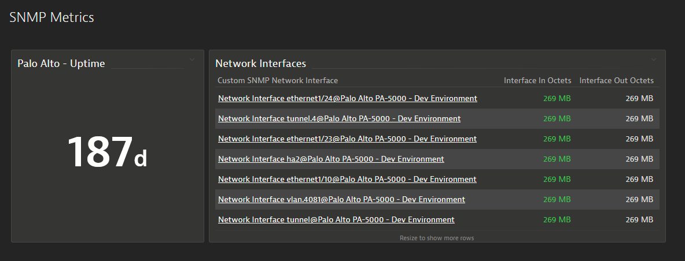
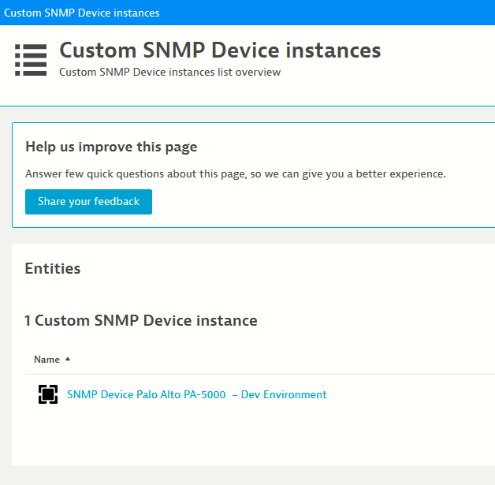
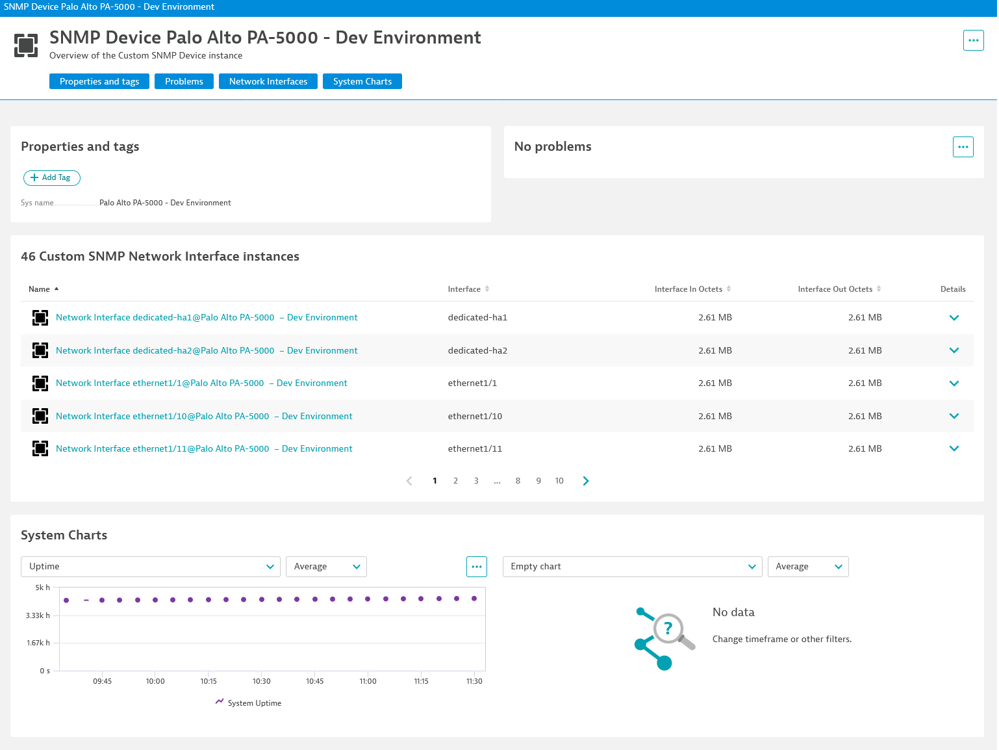

## Visualizing the data

We can see the extension data in different places:

### Data explorer

In the data explorer (`Observe and explore > Explore data`) we can find our metrics:

We can then create custom dashboards with the data:

### Entity Screens

We can also navigate to `/ui/entity/list/custom_snmp:device` to get the list of all SNMP Device instances:

And drill down to a device:

