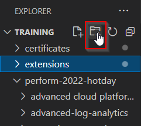

## The basics

The WMI extension will use the OneAgent to collect data about the current Windows host and send them to Dynatrace. Let's start setting up the basic `extension.yaml`

1. Create a folder for your extensions and call it `extensions` using the method described earlier by clicking on the "New folder" icon or typing `mkdir extensions` in C:\Users\dtu_training\Desktop\training
2. Make another folder called `wmi` inside `extensions` the same way.



3. We know every extension has an extension.yaml file so we create it. Click on the "New file" icon in your "wmi" folder and call it `extension.yaml`


4. Add at least the 4 mandatory fields. You may refer to the SNMP example for clues

```yaml
name: custom:wmi.demo
version: 1.0.0
minDynatraceVersion: "1.227"
author:
  name: "Dynatrace User"
```

### For every time you build a new version, you must increase the version number above.

In the next exercises, we can validate our extension by building it and deploying it at different stages. Make sure you increase the version number each time and upload the new version.

To build it at each stage, navigate to your `wmi` folder where the `extension` folder is listed and use dt-cli:
```
dt ext build --certificate ..\..\certificates\developer.pem --private-key ..\..\certificates\developer.key --no-dev-passphrase
```

Next, we will create the WMI section and the data source