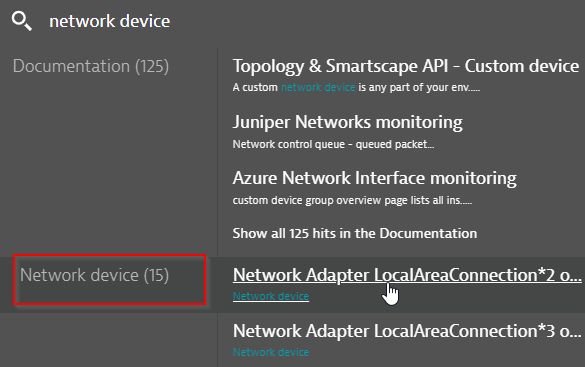
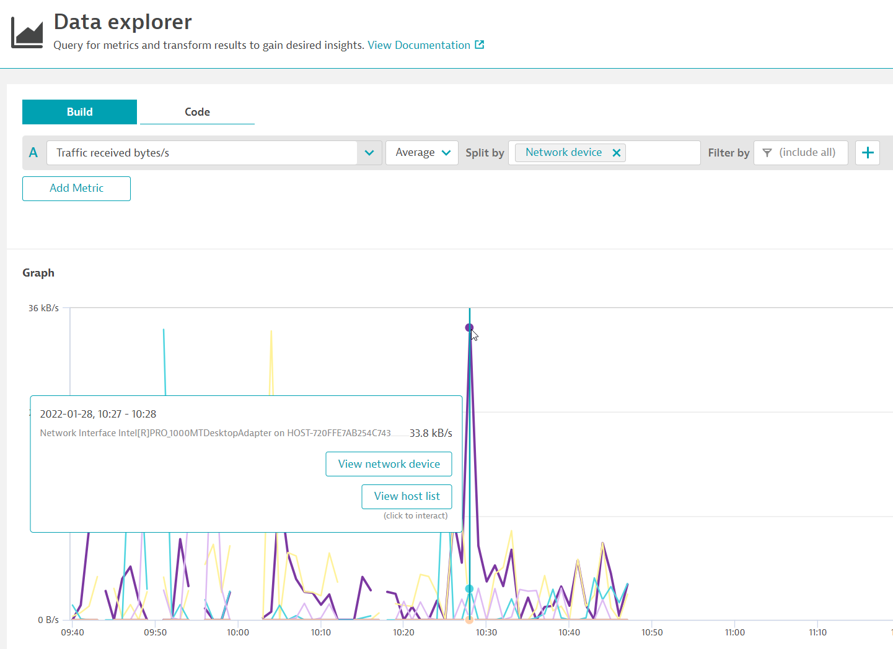

## Topology

Let's explore each portion of our topology example

```yaml
topology:
  types:
    - name: custom_wmi:host
      displayName: Host
      enabled: true
```

Having a well defined topology model helps make sense of all the metrics and data ingested in Dynatrace. 
For extensions 2.0 this all happens in the `topology` section which is split in two parts:
* `types` - defines which new entity types the extension monitors
* `relationships` - defines if and how these entity types relate to each other

We define a `Host` entity type named `custom_wmi:host`

**Key aspects when defining types**
* `idPattern` - must be unique enough to represent each device instance without duplicating it
* `sources` - must define rules for all metrics of the extension that should be split by this entity
  * `condition` - can make use of functions like `$prefix(...)` to define patterns for metric keys
* `attributes` - are optional details that can be extracted from the dimensions of metrics

```yaml
      rules:
        - idPattern: wmi_host_{dt.entity.host}
          sources:
            - sourceType: Metrics
              condition: $prefix(custom.wmi.demo.host)
          attributes: []
          requiredDimensions: []
          instanceNamePattern: Host - {host.name}
```

The rest of our example defines a Network device type
```yaml
    - name: custom_wmi:network_device
      displayName: Network device
      enabled: true
      rules:
        - idPattern: wmi_{dt.entity.host}_{network.type}_{network.name}
          sources:
            - sourceType: Metrics
              condition: $prefix(custom.wmi.demo.network)
          attributes:
            - pattern: '{network.name}'
              key: wmi_network_name
              displayName: Name
            - pattern: '{network.type}'
              key: wmi_network_type
              displayName: Type
          requiredDimensions: []
          instanceNamePattern: Network {network.type} {network.name} on {dt.entity.host}
```

**Key aspects when defining relationships**

```yaml
  relationships:
    - typeOfRelation: RUNS_ON
      fromType: custom_wmi:network_device
      toType: custom_wmi:host
      enabled: true
      sources:
        - sourceType: Metrics
          condition: $prefix(custom.wmi.demo)
```
* `typeOfRelation` - defines if this entity relationship "runs on", is "part of", is "child of" or if it is an "instance of" another entity. Another type of relation is "calls" which is the only horizontal type in that an entity invokes another entity.

* `sources` - any metric that matches the pattern will be evaluated for a relationship. This means 
it should belong to both entity types part of the relationship

**How to find your new entities**
* Using the search bar for your entity type


* Using Data Explorer to split by your entity type. It will automatically link to you Entity screen


* Navigate to `../ui/entity/list/{entity-type}` on your Dynatrace tenant. For example:
* ../ui/entity/list/custom_wmi:host
* ../ui/entity/list/custom\_wmi:network\_device
