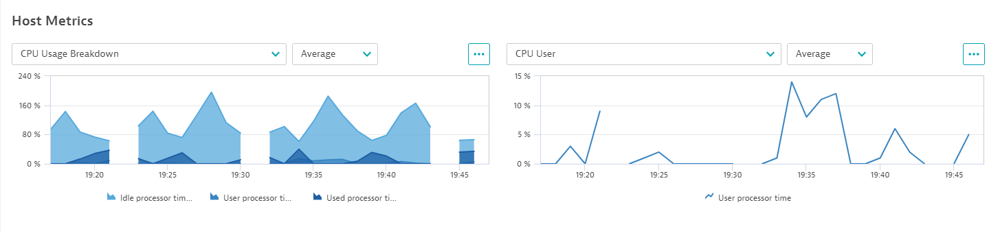
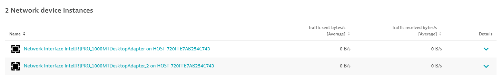
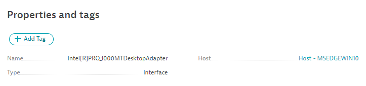

## Screens

Unified Analysis screens are the window into performance analysis and troubleshooting for this newly monitored technology. 
It's an opportunity to eliminate the need for further dashboarding or ad-hoc chart building. The `screens` section will 
define the details to be displayed on each entity's page as well as charts and lists of other related entities for quick 
drilldowns.

The details page is organised into `staticContent` and a `layout` for dynamic content that comprises of `cards` (charts 
and lists).
`staticContent`
* `showProblems` - show a panel for any Problems about this entity
* `showProperties` - show the "Properties and tags" section
* `showTags` - show the tags applied to this entity
* `showGlobalFilter` - show the global filtering bar
* `showAddTag` - show the "Add Tag" button

The `layout` consists of different cards defined in the `chartsCards` and `entitiesListCards` sub-sections.

**Charts cards**

A chart card is a section of the screen which displays charts. All possible charts are defined in the card, and a number of them can be displayed at the same time on the screen. The others are available from the dropdown above the chart.

Charts cards rely on [metric selectors](https://www.dynatrace.com/support/help/dynatrace-api/environment-api/metric-v2/metric-selector) to correctly display metrics.



Simple chart card example:
```yaml
chartsCards:
  - key: "host-cpu-metrics"
    displayName: "Host CPU"
    numberOfVisibleCharts: 2
    charts:
      - displayName: "Idle CPU"
        metrics:
          - metricSelector: "custom.wmi.demo.host.cpu.time.idle:SplitBy()"
      - displayName: "User CPU"
        metrics:
          - metricSelector: "custom.wmi.demo.cpu.time.user:SplitBy()"

```

**Entities list cards**

An entity list is a list of entities that are somehow related to the currently viewed entity. Additional metrics can be charted in the detail of each returned entity and will show as a single value in the list view.

Entity lists rely on [entity selectors](https://www.dynatrace.com/support/help/dynatrace-api/environment-api/entity-v2/entity-selector) to correctly list out related entities.



Simple entity list example:
```yaml
entitiesListCards:
  - key: "nic-list"
    displayName: "Network Interfaces"
    entitySelectorTemplate: "type(custom_wmi:network_device),fromRelationships.runsOn($(entityConditions)),wmi_network_type(Interface)"
    displayCharts: false
    displayIcons: true
    enableDetailsExpandability: true
```

**Note:** `$(entityConditions)` is a function that automatically maps to the currently viewed entity. This is mandatory for entity selectors used in the extension.

**The properties card**

The `propertiesCard` of an entity can also be modified to include additional properties or hide unnecessary ones. Properties are extracted from entity attributes (when type is `ATTRIBUTE`) or through an entity selector (when type is `RELATION`).



### Adding screens section

The Host entity page will have 3 cards:
* A chart card for Host metrics
* An entity card for Network interfaces
* An entity card Network adapters

```yaml
screens:
  - entityType: custom_wmi:host
    detailsSettings:
      staticContent:
        showProblems: true
        showProperties: true
        showTags: true
        showGlobalFilter: true
        showAddTag: true
      layout:
        autoGenerate: false
        cards:
          - type: "CHART_GROUP"
            key: "wmi_host-chart-metrics"
          - type: "ENTITIES_LIST"
            key: "wmi_host-list-network_interfaces"
          - type: "ENTITIES_LIST"
            key: "wmi_host-list-network_adapters"
```

The chard card for the host will contain 2 visible cards side by side. The following snippet defines their headers, which metrics displayed in the selector and colors.

```yaml
chartsCards:
      - key: "wmi_host-chart-metrics"
        displayName: "Host Metrics"
        numberOfVisibleCharts: 2
        charts:
          - displayName: "CPU Usage Breakdown"
            visualization:
              themeColor: BLUE
              seriesType: AREA
            metrics:
              - metricSelector: "custom.wmi.demo.host.cpu.time.idle:SplitBy()"
              - metricSelector: "custom.wmi.demo.host.cpu.time.user:SplitBy()"
              - metricSelector: "custom.wmi.demo.host.cpu.time.processor:SplitBy()"
          - displayName: "CPU User"
            visualization:
              themeColor: BLUE
              seriesType: LINE
            metrics:
              - metricSelector: "custom.wmi.demo.host.cpu.time.user:SplitBy()"
          - displayName: "CPU Idle"
            visualization:
              themeColor: BLUE
              seriesType: LINE
            metrics:
              - metricSelector: "custom.wmi.demo.host.cpu.time.idle:SplitBy()"
          - displayName: "CPU Used"
            visualization:
              themeColor: BLUE
              seriesType: LINE
            metrics:
              - metricSelector: "custom.wmi.demo.host.cpu.time.processor:SplitBy()"
```

The two entity list cards will show interfaces and adapters. Remember that the `$(entityConditions)` function refers to itself, the entity you are currently viewing. This will allow to link the network device listed to its own entity page which will be defined later.

```yaml
    entitiesListCards:
      - key: "wmi_host-list-network_interfaces"
        displayName: "Network Interfaces"
        entitySelectorTemplate: "type(custom_wmi:network_device),fromRelationships.runsOn($(entityConditions)),wmi_network_type(Interface)"
        pageSize: 5
        displayCharts: false
        displayIcons: true
        enableDetailsExpandability: true
        numberOfVisibleCharts: 1
        charts: 
          - displayName: "Traffic"
            visualization:
              themeColor: BLUE
              seriesType: AREA
            metrics:
              - metricSelector: "custom.wmi.demo.network.bytes.sent.persec:SplitBy()"
              - metricSelector: "custom.wmi.demo.network.bytes.received.persec:SplitBy()"
      - key: "wmi_host-list-network_adapters"
        displayName: "Network Adapters"
        entitySelectorTemplate: "type(custom_wmi:network_device),fromRelationships.runsOn($(entityConditions)),wmi_network_type(Adapter)"
        pageSize: 5
        displayCharts: false
        displayIcons: true
        enableDetailsExpandability: true
        numberOfVisibleCharts: 1
        charts: 
          - displayName: "Traffic"
            visualization:
              themeColor: BLUE
              seriesType: AREA
            metrics:
              - metricSelector: "custom.wmi.demo.network.bytes.sent.persec:SplitBy()"
              - metricSelector: "custom.wmi.demo.network.bytes.received.persec:SplitBy()"
```

The network device page will list its own chart cards, properties and metrics with its own selectors

```yaml
  - entityType: custom_wmi:network_device
    propertiesCard:
      properties:
        - type: ATTRIBUTE
          attribute:
            key: wmi_network_name
            displayName: Name
        - type: ATTRIBUTE
          attribute:
            key: wmi_network_type
            displayName: Type
        - type: RELATION
          relation:
            entitySelectorTemplate: type(custom_wmi:host),toRelationships.runsOn($(entityConditions))
            displayName: Host
    detailsSettings:
      staticContent:
        showProblems: true
        showProperties: true
        showTags: true
        showGlobalFilter: true
        showAddTag: true
      layout:
        autoGenerate: false
        cards:
        - type: "CHART_GROUP"
          key: "custom_wmi_network_device-chart-traffic"
    chartsCards:
      - key: "custom_wmi_network_device-chart-traffic"
        displayName: "Traffic"
        numberOfVisibleCharts: 2
        charts:
          - displayName: "Traffic breakdown"
            visualization:
              themeColor: BLUE
              seriesType: AREA
            metrics:
              - metricSelector: "custom.wmi.demo.network.bytes.persec:SplitBy()"
              - metricSelector: "custom.wmi.demo.network.bytes.sent.persec:SplitBy()"
              - metricSelector: "custom.wmi.demo.network.bytes.received.persec:SplitBy()"
          - displayName: "Bytes sent"
            visualization:
              themeColor: BLUE
              seriesType: LINE
            metrics:
              - metricSelector: "custom.wmi.demo.network.bytes.sent.persec:SplitBy()"
          - displayName: "Bytes received"
            visualization:
              themeColor: BLUE
              seriesType: LINE
            metrics:
              - metricSelector: "custom.wmi.demo.network.bytes.sent.persec:SplitBy()"
          - displayName: "Bytes"
            visualization:
              themeColor: BLUE
              seriesType: LINE
            metrics:
              - metricSelector: "custom.wmi.demo.network.bytes.sent.persec:SplitBy()"
```

## Tasks
1. Compile the `screens` section to your `extension.yaml`
2. Customize the details page settings for both the Host and the Network Device entity types.
3. Use charts cards to display all the metrics of each entity
4. Add entity list cards so that a Host can list out all Network Adapters and Interfaces running on it
5. Add a relation based property so that a Network Device displays what Host it runs on.
6. Build, package and upload a new version of your extension
7. Validate your screens are showing up as expected

Your end result should look like [this](../../assets/images/05_wmi_screens.yaml)
